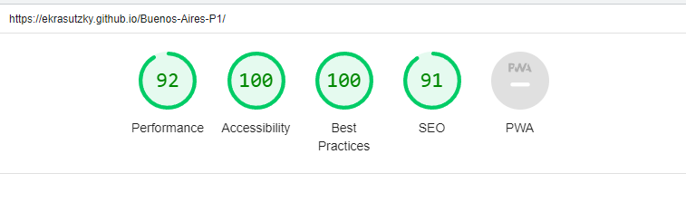

# Buenos Aires

This project is about to try to show a bit of Buenos Aires City (city where i was born). This came up because after living four years abroad, i was a bit homesick and i got this idea.

I thought about this website as a good option to try to show future tourists a little bit of where to start discovering this amazing city. 
Users of Buenos Aires website, will find four basics cathegories : Food, Culture , City and Newsletter. In these categories they'll finde options to enjoy some good food, entertainment options, places to visit and of course, a newsletter section where they can suscribe to ask anything and/or get more suggestions of what to do in this city. 

Buenos Aires is a website that encourages future visitors to have a little idea of where to start their trip. It aims to cover the basics to enjoy this great city.

# Features
## ♥ Navigation Bar

- A navigation bar has been added to help the user to find different sections easily. It includes links to Home Page, Culture, City and a Newsletter page. 
The same navigation bar is displayed in every page letting the user navigate through the website without going back to previous pages. 

        ♥ In smaller screen sizes a hamburger menu has been added for an esier navigation.

## ♥ First View of the site

- First thing the user will see, is the logo and the nav bar and after that, a big image with a cover text displayed . 

- This image and all around it was decided to be like that in order to catch users' eye and produce an impact on them with all the colors from the image and a welcoming text. 

        ♥ The color scheme has been chosen and applied through the whole website on purpose, since blue, white and yellow are Argentina's flag colors.

## ♥ Activities section

- This section contains a preview of what the user will find through the website with clickable links that will lead to their own section. 

## ♥ Footer

- A footer's been added in the main page , as well in all the four different pages to help the user get more info on the social media. 

## ♥ Newsletter section
- This page will allow the user to get signed up to Buenos Aires website. The user will be able to get more info about activities in this City by submitting  their full name and email address.

### Features Left to Implement
 
 - Maps in the Food, Citty and Culture pages.

 ## ♥ Validator Testing
- HTML:
No errors were returned when passing through the official W3C validator

- CSS :
No errors were found when passing through the official (Jigsaw) validator

- Lighthouse:
I ran a test on Lighthouse to check the accesibility and performance  of the website

## ♥ Deployment
- The site was deployed to GitHub pages. The steps to deploy are as follows:
1. In the GitHub repository, navigate to the Settings tab
From the source section drop-down menu, select the Master Branch
2. Once the master branch has been selected, the page will be automatically refreshed with a detailed ribbon display to indicate the successful deployment.

The live link can be found here : https://ekrasutzky.github.io/Buenos-Aires-P1/
